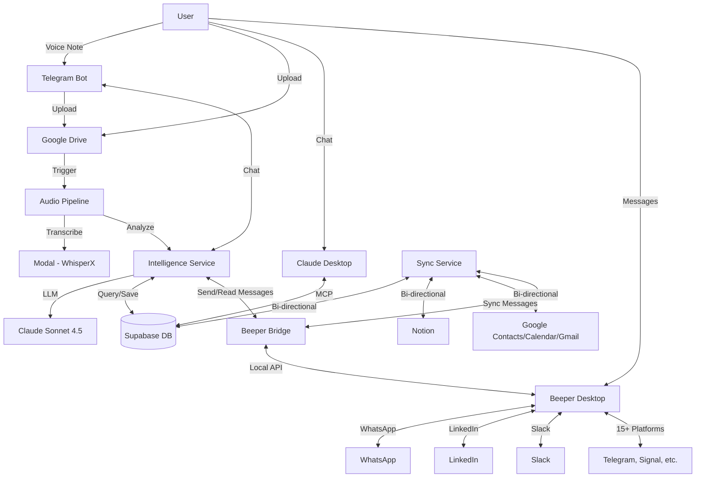

#  Jarvis Ecosystem

> **A personal AI that truly knows you - building my second brain, one voice note at a time.**

Welcome to the Jarvis Ecosystem! This is a work-in-progress personal AI assistant that helps you organize your life by processing voice notes, syncing your contacts and calendar, and providing intelligent insights.

**Current Status:** Phase 1 (Data Hub) - Building the foundation. The system can transcribe voice notes, analyze them with AI, and sync data across multiple platforms. RAG and conversational AI coming in later phases.

The system is composed of 4 microservices that work together.

---

# ⭐ North Star

> **The future belongs to those who build their memory today.**

### The Vision

One day, everyone will have a personal AI that truly knows them. **By building Jarvis now, we get an unfair advantage** - not because others won't catch up, but because even perfect alternatives need one thing we'll already have: *data*.

---

## The Three Pillars

### 1️⃣ Aggregate Everything
*Capture data from wherever life happens*

Conversations, emails, messages, meetings, notes, locations, health, finances - every signal matters. The longer the system runs, the smarter it gets. **This compounds.**

Phase 1 isn't just infrastructure. It's the foundation of compounding knowledge. Every day adds more context, more memories, more signal. **This alone is valuable.**

And by building everything in a highly modular way, we are future proof. Everything is composable. New AI models? Plug them in. New data sources? Connect them. New services? Integrate them. The architecture doesn't lock us in - it opens doors to whatever comes next.

### 2️⃣ Multiply Productivity
*Offload cognitive overhead, focus on what matters*

- **Perfect recall**: Never forget a conversation, commitment, or insight
- **Contextual awareness**: Know who you're meeting, what you discussed, what matters
- **Proactive support**: Information finds you at the right moment
- **Reduced friction**: Stop chasing data - let it work for you

### 3️⃣ Strengthen Memory & Learning
*Turn the biggest danger into the biggest opportunity*

**The risk**: Brain 1.0 outsources too much to Brain 2.0 and atrophies.

**The solution**: Make it a two-way highway. Jarvis doesn't just store - it *challenges* us:

- Resurface topics to reinforce memory (spaced repetition)
- Quiz us: "What was the name of John's friend you met last week?"
- Identify knowledge gaps and generate study materials
- Turn passive storage into active learning

**The goal isn't to replace human memory - it's to strengthen it.** Jarvis becomes a personal trainer for your brain.

---

### The Bigger Dream: Connected Knowledge

A personal knowledge graph is powerful. But what if we could *link* them?

- **Friends**: Share memories, resurface shared experiences
- **Teams**: Collective organizational memory that compounds
- **Networks**: Cross-pollinate ideas across communities

Imagine randomly combining memories across people. Can we *dream together*? Can serendipity be engineered?

---

### True North Star

**Unlimited possibilities.** We don't know exactly where this leads - and that's the point. We're building the infrastructure to explore.

---

##  Architecture Overview



## 🛠️ Tech Stack

- **Intelligence**: Python, FastAPI, Anthropic Claude (Sonnet 4.5)
- **Transcription**: Modal (WhisperX)
- **Database**: Supabase (PostgreSQL)
- **Infrastructure**: Google Cloud Run (Serverless), Cloud Build (CI/CD)
- **Interface**: Telegram Bot
- **Messaging**: Beeper Desktop (WhatsApp, LinkedIn, Telegram, Slack, 15+ platforms)
- **Local Bridge**: Docker, Cloudflare Tunnel

## 🚀 Deployment

All cloud services deploy automatically via **Cloud Build** when you push to their default branch.

| Service | Branch | Trigger | Location |
|---------|--------|---------|----------|
| Intelligence Service | `master` | `jarvis-intelligence-service-deploy` | Cloud Run |
| Sync Service | `master` | `jarvis-sync-service-deploy` | Cloud Run |
| Audio Pipeline | `main` | `jarvis-audio-pipeline-deploy` | Cloud Run |
| Telegram Bot | `main` | `jarvis-telegram-bot-deploy` | Cloud Run |
| **Beeper Bridge** | N/A | Manual Docker | **Local Laptop** |

```bash
# Example: Deploy Intelligence Service
cd jarvis-intelligence-service
git add -A && git commit -m "Your changes" && git push origin master
```

**DO NOT** manually deploy via `gcloud builds submit` - it will fail due to missing substitution variables.

## �🔄 Key Workflows

### 1. Voice Note Processing
1. User sends voice note to Telegram Bot.
2. Bot uploads file to Google Drive.
3. Audio Pipeline detects file, downloads it.
4. Modal transcribes audio (GPU-accelerated).
5. Transcript sent to Intelligence Service.
6. Intelligence Service analyzes (extracts tasks, meetings, reflections).
7. Data saved to Supabase.
8. Sync Service pushes updates to Notion.

### 2. Messaging via Beeper (WhatsApp, LinkedIn, etc.)
1. User asks Jarvis via Telegram: "Send a message to John on WhatsApp"
2. Intelligence Service queries contacts, finds John
3. Intelligence Service checks Beeper Bridge for John's WhatsApp chat
4. Jarvis asks: "What would you like to say?"
5. User responds with message content
6. Jarvis shows draft and asks for confirmation
7. User confirms: "yes, send it"
8. Intelligence Service calls Beeper Bridge → Beeper Desktop → WhatsApp
9. Message delivered, conversation archived in Supabase

### 3. Daily Journaling
1. Sync Service triggers "Evening Journal" prompt.
2. Intelligence Service analyzes day's activities (Calendar, Emails, Tasks).
3. Generates personalized reflection questions.
4. Sends prompt via Telegram.
5. User replies with voice/text.
6. Reply processed as a Journal Entry.

### 4. Smart Sync
- **Gmail**: Incremental sync using `historyId` (only fetches changes).
- **Calendar**: Incremental sync using `syncToken`.
- **Contacts**: Bidirectional sync with Notion CRM.
- **Beeper Messages**: Syncs messages/chats to Supabase every 15 minutes.

##  The 5 Microservices

| Service | Role | Description | Tech Stack |
|---------|------|-------------|------------|
| **[Intelligence Service](https://github.com/JulienMaterno/jarvis-intelligence-service)** | 🧠 **THE CORE** | The brain of the ecosystem. ALL AI processing happens here. Receives requests from other services, analyzes data with Claude, orchestrates business logic, and controls messaging. | FastAPI, Cloud Run, Anthropic Claude |
| **[Audio Pipeline](https://github.com/JulienMaterno/jarvis-audio-pipeline)** | 🎤 Ingestion | Monitors Google Drive for audio, transcribes using Modal (GPU), saves transcript, then **calls Intelligence Service** for analysis. No AI here - audio only. | Python, Modal, Google Drive API |
| **[Sync Service](https://github.com/JulienMaterno/jarvis-sync-service)** | 🔄 Pure Sync | Bidirectional sync between Notion, Google, Beeper, and Supabase. No AI, no business logic - just keeps data in sync across platforms. | Python, Notion API, Google APIs |
| **[Telegram Bot](https://github.com/JulienMaterno/jarvis-telegram-bot)** | 📱 User Interface | Entry point for voice notes and chat. Uploads audio to Drive (triggers Audio Pipeline), and **calls Intelligence Service** for chat. Also receives notifications. | Python, Telegram API |
| **[Beeper Bridge](https://github.com/JulienMaterno/jarvis-beeper-bridge)** | 💬 Messaging Hub | Local bridge to Beeper Desktop, enabling unified messaging across WhatsApp, LinkedIn, Telegram, Slack, and 15+ platforms. **Called by Intelligence Service** for sending/reading messages. | Python, FastAPI, Docker, Cloudflare Tunnel |

### Architecture Principle: Intelligence Service is the Hub

```
┌─────────────────┐     ┌─────────────────┐     ┌─────────────────┐
│  Audio Pipeline │     │  Telegram Bot   │     │  Sync Service   │
│   (Audio Only)  │     │ (User Interface)│     │  (Pure Sync)    │
└────────┬────────┘     └────────┬────────┘     └────────┬────────┘
         │                       │                       │
         │   ┌───────────────────┴───────────────────┐   │
         │   │                                       │   │
         ▼   ▼                                       │   │
┌─────────────────────────────────────────┐          │   │
│      🧠 Intelligence Service            │          │   │
│      ─────────────────────────          │          │   │
│      • ALL AI (Claude 3.5 Haiku)        │          │   │
│      • ALL Business Logic               │          │   │
│      • Task Extraction                  │          │   │
│      • Journal Analysis                 │          │   │
│      • Meeting Processing               │          │   │
│      • Messaging Control (Beeper)       │          │   │
│      • Future: Chat, RAG, etc.          │          │   │
└─────────────────┬───────────────────────┘          │   │
                  │                   │               │   │
                  │                   ▼               │   │
                  │         ┌─────────────────┐      │   │
                  │         │ Beeper Bridge   │      │   │
                  │         │  (Local/Docker) │      │   │
                  │         └─────────┬───────┘      │   │
                  │                   │               │   │
                  │                   ▼               │   │
                  │         ┌─────────────────┐      │   │
                  │         │ Beeper Desktop  │      │   │
                  │         │ (WhatsApp, etc.)│      │   │
                  │         └─────────────────┘      │   │
                  ▼                                   ▼   ▼
         ┌─────────────────────────────────────────────────┐
         │              Supabase (Central DB)              │
         │  ─────────────────────────────────────────────  │
         │  contacts │ meetings │ tasks │ reflections │... │
         └─────────────────────────────────────────────────┘
```

---

#  Roadmap

## Phase 1: Data Hub 
> **Goal**: Build the unified Supabase database. Redirect all pipelines to write here first. Notion becomes a sync target, not the source of truth.

### 1.1 Contact Sync (Bidirectional)
*Supabase  Notion  Google Contacts*
- [x] Setup Supabase project
- [x] Design contacts table
- [x] Delete old contacts (850  105)
- [x] Merge Notion and Google Contacts
- [x] Sync locally with backups
- [x] Run sync in Cloud
- [x] Conflict resolution strategy
- [x] Test for 3 days

### 1.2 Redirect Transcription Pipeline
*Google Drive  WhisperX  Supabase (not Notion)*
- [x] Build pipeline locally
- [x] Test pipeline locally
- [x] Design meetings/reflections/task tables in Supabase
- [x] Define which fields LLM can write
- [x] Build Supabase update functions
- [x] Modify to write to Supabase instead of Notion
- [x] Route to correct table based on type
- [x] LLM extracts updates from conversations
- [x] Implement in Cloud
- [ ] Test for 3 days

### 1.3 Tasks Sync
*Supabase  Google Tasks  Notion*
- [ ] Connect Google Tasks API
- [x] Connect Notion
- [x] Build bidirectional sync
- [x] Handle conflicts
- [ ] Test sync across all 3 systems

### 1.4 Email & Calendar Sync
*Gmail + Google Calendar integration*
- [x] Connect Gmail API
- [x] Connect Google Calendar API
- [x] Build email sync pipeline to Supabase
- [x] Build calendar sync
- [ ] Link emails + meetings to contacts

### 1.5 Monitoring & Health System ✅
*Comprehensive health monitoring for all services*
- [x] Dashboard showing sync status
- [x] Health monitoring system (`/health/full` endpoint)
- [x] Daily health reports at 8am via Telegram
- [x] Centralized error logging in `sync_logs` table
- [x] Component-level health checks (Database, Sync, Calendar, Gmail, Contacts)
- [x] Data integrity monitoring (unlinked meetings, orphaned records)
- [x] Error notifications (disabled by default - stored in DB instead)

## Phase 2: Jarvis First Steps 
> **Goal**: Build useful features with direct queries. No RAG needed - LLM works with explicit data you give it.

### 2.1 Telegram as LLM Interface
*First Jarvis! Two-way interaction via Telegram*
- [x] Setup Telegram Bot API
- [x] Send text messages → route to LLM
- [x] Send voice messages → transcribe → route to LLM
- [ ] LLM queries Supabase for context
- [ ] Send LLM responses back via Telegram
- [x] Receive workflow error messages
- [x] **Evening journal prompts at 7pm**
- [x] **Morning health reports at 8am**
- [ ] **Chat history in Supabase**
- [ ] **Memory system in Supabase**

### 2.2 Claude Desktop  Supabase MCP
*Give Claude Desktop direct access to your data*
- [x] Build Supabase MCP server
- [x] Expose tools: get_contact, get_meetings, get_tasks, update_contact
- [x] Connect to Claude Desktop locally
- [x] Test queries

### 2.3 - 2.8 (Planned)
- End-of-Day Prompts
- Daily Digest
- Pre-Meeting Briefing
- Follow-up Reminders
- Email Draft Suggestions
- Memory Challenges

## Phase 3: RAG & Deep Context 
> **Goal**: Add vectors and semantic search. Jarvis can now find relevant context across everything and truly "know" you.

- WhatsApp Archive Import
- Vector Infrastructure (pgvector)
- Backfill Embeddings
- RAG Query Layer
- Advanced Use Cases (Memory Quizzes, Smart CRM)

## Phase 4: Real Jarvis 
> **Goal**: Real-time voice conversations with full access to your knowledge base and ability to take actions.

- Voice Interface Setup (OpenAI Realtime / Vapi)
- Tool Integration (Voice access to CRM/Tasks)
- Action Capabilities (Send messages, draft emails)
- Always-On Mode
- Proactive Jarvis
- Spaced Repetition Learning System
- Knowledge Gap Analysis
- Local/Private Option

---

##  Getting Started Guide

### 1. Clone the Ecosystem

To set this up, you should clone all repositories into a single folder:

`ash
mkdir Jarvis
cd Jarvis

# Clone the documentation (this repo)
git clone https://github.com/JulienMaterno/jarvis-ecosystem.git

# Clone the services
git clone https://github.com/JulienMaterno/jarvis-audio-pipeline.git
git clone https://github.com/JulienMaterno/jarvis-intelligence-service.git
git clone https://github.com/JulienMaterno/jarvis-sync-service.git
git clone https://github.com/JulienMaterno/jarvis-telegram-bot.git
`

### 2. Prerequisites & Accounts

You will need accounts for the following services:

*   **Supabase**: For the database. [Sign up here](https://supabase.com/).
*   **Modal**: For GPU-powered transcription. [Sign up here](https://modal.com/).
*   **Anthropic**: For the AI intelligence (Claude). [Get API Key](https://console.anthropic.com/).
*   **Google Cloud**: For Drive, Calendar, and Contacts APIs. [Console](https://console.cloud.google.com/).
*   **Notion**: For the frontend UI. [Developers](https://www.notion.so/my-integrations).
*   **Telegram**: To create your bot. Talk to [@BotFather](https://t.me/botfather).

### 3. Database Setup (Supabase)

1.  Create a new project in Supabase.
2.  Go to the **SQL Editor** in the Supabase dashboard.
3.  Run the following SQL scripts to create the necessary tables:

**Core Schema (Contacts, Meetings, Logs):**
`sql
-- Copy content from: jarvis-sync-service/migrations/schema.sql
-- (See file for full content)
`

**Calendar & Email Schema:**
`sql
-- Copy content from: jarvis-sync-service/migrations/add_calendar_and_mail.sql
-- (See file for full content)
`

**Intelligence Schema (Transcripts, Tasks, Reflections):**
`sql
-- Transcripts Table
CREATE TABLE IF NOT EXISTS transcripts (
    id UUID PRIMARY KEY DEFAULT gen_random_uuid(),
    filename TEXT NOT NULL,
    content TEXT,
    summary TEXT,
    created_at TIMESTAMP WITH TIME ZONE DEFAULT timezone('utc'::text, now()) NOT NULL,
    processed BOOLEAN DEFAULT FALSE,
    metadata JSONB DEFAULT '{}'::jsonb
);

-- Tasks Table (AI Generated)
CREATE TABLE IF NOT EXISTS tasks (
    id UUID PRIMARY KEY DEFAULT gen_random_uuid(),
    description TEXT NOT NULL,
    status TEXT DEFAULT 'todo',
    due_date TIMESTAMP WITH TIME ZONE,
    source_transcript_id UUID REFERENCES transcripts(id),
    created_at TIMESTAMP WITH TIME ZONE DEFAULT timezone('utc'::text, now())
);

-- Reflections Table (AI Generated)
CREATE TABLE IF NOT EXISTS reflections (
    id UUID PRIMARY KEY DEFAULT gen_random_uuid(),
    content TEXT NOT NULL,
    tags TEXT[],
    source_transcript_id UUID REFERENCES transcripts(id),
    created_at TIMESTAMP WITH TIME ZONE DEFAULT timezone('utc'::text, now())
);
`

### 4. Service Setup

Follow the detailed setup guides in each repository:

1.  **[Setup Intelligence Service](https://github.com/JulienMaterno/jarvis-intelligence-service)** (Deploy this first)
2.  **[Setup Audio Pipeline](https://github.com/JulienMaterno/jarvis-audio-pipeline)** (Connects to Intelligence Service)
3.  **[Setup Sync Service](https://github.com/JulienMaterno/jarvis-sync-service)** (Runs periodically to sync data)
4.  **[Setup Telegram Bot](https://github.com/JulienMaterno/jarvis-telegram-bot)** (Optional, for mobile input)

---

##  Common Operations

### How to process a voice note manually?
Drop an audio file into the configured Google Drive folder. The jarvis-audio-pipeline will pick it up automatically.

### How to force a sync?
Run the sync script manually:
`ash
cd jarvis-sync-service
python run_full_sync.py
`
### How to check system health?
The system has built-in health monitoring:

**Quick health check:**
```bash
curl https://jarvis-sync-service-XXX.run.app/health
```

**Full health report:**
```bash
curl https://jarvis-sync-service-XXX.run.app/health/full
```

**Send health report to Telegram:**
```bash
curl -X POST https://jarvis-sync-service-XXX.run.app/health/report
```

The health check monitors:
- ✅ **Database**: Connection and table accessibility
- ✅ **Sync Operations**: Errors in the last 24 hours
- ✅ **Data Integrity**: Unlinked meetings, orphaned records
- ✅ **Calendar Sync**: Recent sync success/errors
- ✅ **Gmail Sync**: Recent sync success/errors
- ✅ **Contact Sync**: Google Contacts sync status
- ✅ **Recent Activity**: Transcripts and meetings processed
### Where do I see my data?
*   **Raw Data**: Supabase Dashboard
*   **User Interface**: Your Notion Workspace (Meetings, Tasks, CRM databases)

### Automated Schedules (Cloud Scheduler)
The system runs several automated jobs:

| Job | Schedule | Description |
|-----|----------|-------------|
| `jarvis-sync-hourly` | Every 15 min | Main sync (Contacts, Meetings, Calendar, Gmail) |
| `jarvis-daily-report` | 7pm SGT | Evening journal prompt via Telegram |
| `jarvis-daily-health` | 8am SGT | Morning health check report via Telegram |

To manage schedules:
```bash
# List all jobs
gcloud scheduler jobs list --location=asia-southeast1

# Manually trigger a job
gcloud scheduler jobs run jarvis-daily-health --location=asia-southeast1

# Pause a job
gcloud scheduler jobs pause jarvis-sync-hourly --location=asia-southeast1
```

---

##  Legal & Privacy Disclaimer

*   **Data Privacy**: This system is designed to be **self-hosted**. You own your data. However, by using third-party APIs (Google, Anthropic, Notion, Telegram), you are subject to their respective privacy policies.
*   **Costs**: You are responsible for all API usage costs.
    *   **Modal**: Charges for GPU usage (transcription).
    *   **Anthropic**: Charges per token (AI analysis).
    *   **Google Cloud**: May incur costs for storage or Cloud Run usage.
*   **License**: This project is open-source under the **MIT License**. You are free to use, modify, and distribute it, but it comes with **no warranty**.
*   **Trademarks**: 'Jarvis' is a reference to the AI assistant from Marvel's Iron Man. This project is a personal hobby project and is not affiliated with, endorsed by, or connected to Marvel Studios or Disney.
