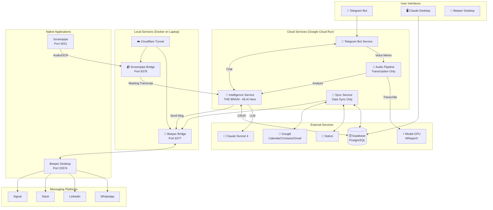

# 🧠 Jarvis Ecosystem

> **A personal AI that truly knows you - building my second brain, one voice note at a time.**

Welcome to the Jarvis Ecosystem! This is a **production-grade** personal AI assistant that processes voice notes, syncs across platforms, manages messaging, and captures meeting context automatically.

**Current Status:** Phase 2 (Conversational AI) - The system is live and processing daily. Voice memos, meetings, and tasks flow through the system 24/7. Memory system and deeper chat capabilities are actively being developed.

---

## 🌟 What Makes Jarvis Unique

| Feature | Description |
|---------|-------------|
| 🎤 **Voice-First** | Send voice memos via Telegram → transcribed → analyzed → tasks/meetings extracted |
| 💬 **Unified Messaging** | Send/read messages across WhatsApp, LinkedIn, Slack, Telegram via single interface |
| 📹 **Automatic Meeting Capture** | Screenpipe captures any meeting (Zoom, Meet, WhatsApp) automatically |
| 🔄 **Bi-directional Sync** | Data flows between Supabase ↔ Notion ↔ Google seamlessly |
| 🧠 **Centralized Intelligence** | All AI logic lives in one place - easy to upgrade, maintain, debug |
| 🏠 **Self-Hosted** | Your data, your servers, your control |

---

## ⭐ North Star

> **The future belongs to those who build their memory today.**

### The Vision

One day, everyone will have a personal AI that truly knows them. **By building Jarvis now, we get an unfair advantage** - not because others won't catch up, but because even perfect alternatives need one thing we'll already have: *data*.

### The Three Pillars

#### 1️⃣ Aggregate Everything
*Capture data from wherever life happens*

Voice memos, emails, messages, meetings, calendar, health - every signal matters. The longer the system runs, the smarter it gets. **This compounds.**

#### 2️⃣ Multiply Productivity
*Offload cognitive overhead, focus on what matters*

- **Perfect recall**: Never forget a conversation, commitment, or insight
- **Contextual awareness**: Pre-meeting briefings with contact history
- **Proactive support**: Information finds you at the right moment

#### 3️⃣ Strengthen Memory & Learning
*Turn passive storage into active learning*

Jarvis doesn't just store - it *challenges* you with spaced repetition, quizzes, and knowledge gap analysis. **The goal isn't to replace human memory - it's to strengthen it.**

---

## 🏗️ Architecture Overview



---

## 🛠️ Tech Stack & Integrations

### Core Technologies

| Layer | Technology | Purpose |
|-------|------------|---------|
| **AI/LLM** | Claude Sonnet 4 (Anthropic) | Analysis, chat, task extraction |
| **Transcription** | WhisperX on Modal (A10G GPU) | Voice memo → text |
| **Database** | Supabase (PostgreSQL + pgvector) | Central data store + vectors |
| **Compute** | Google Cloud Run | Serverless containers |
| **CI/CD** | Google Cloud Build | Auto-deploy on push |

### External Integrations

| Platform | Integration Type | What It Does |
|----------|-----------------|--------------|
| **Telegram** | Bot API + Webhooks | Voice memos, chat interface, notifications |
| **Notion** | API | CRM, task management, journals (bidirectional sync) |
| **Google Calendar** | API | Event sync, meeting context |
| **Google Contacts** | People API | Contact sync |
| **Gmail** | API | Email sync for context |
| **WhatsApp** | Via Beeper | Send/receive messages |
| **LinkedIn** | Via Beeper | Send/receive messages |
| **Slack** | Via Beeper | Send/receive messages |
| **Signal, Telegram, 15+ more** | Via Beeper | Unified messaging |

### Local Components

| Component | Port | Purpose |
|-----------|------|---------|
| **Screenpipe** (Native) | 3031 | Screen OCR + audio capture |
| **Beeper Desktop** (Native) | 23374 | Multi-platform messaging |
| **Screenpipe Bridge** (Docker) | 8378 | Meeting detection + forwarding |
| **Beeper Bridge** (Docker) | 8377 | Messaging API proxy |
| **Cloudflare Tunnel** (Docker) | - | Secure cloud ↔ local connection |

---

## 📦 The 6 Microservices

| Service | Location | Role | Key Responsibility |
|---------|----------|------|-------------------|
| [🧠 Intelligence Service](jarvis-intelligence-service/) | Cloud Run | **THE BRAIN** | ALL AI processing, analysis, chat, orchestration |
| [🎤 Audio Pipeline](jarvis-audio-pipeline/) | Cloud Run | Ears | Transcription only (no AI) |
| [🔄 Sync Service](jarvis-sync-service/) | Cloud Run | Hands | Bidirectional data sync (no AI) |
| [📱 Telegram Bot](jarvis-telegram-bot/) | Cloud Run | Interface | User input/output (no AI) |
| [💬 Beeper Bridge](jarvis-beeper-bridge/) | Local Docker | Messenger | Unified messaging gateway |
| [📹 Screenpipe Bridge](jarvis-screenpipe-bridge/) | Local Docker | Eyes | Auto meeting capture |

### Architecture Principle: Intelligence Service is the Hub

```
              ┌─────────────────────────────────────────────────────────┐
              │              🧠 INTELLIGENCE SERVICE                     │
              │  ─────────────────────────────────────────────────────  │
              │  • ALL AI (Claude Sonnet 4)                             │
              │  • Task extraction, journal analysis, meeting processing │
              │  • Chat with context/memory                              │
              │  • Messaging control (via Beeper Bridge)                 │
              │  • Meeting processing (from Screenpipe Bridge)           │
              └───────────────────────┬─────────────────────────────────┘
                                      │
        ┌─────────────────────────────┼─────────────────────────────┐
        │                             │                             │
        ▼                             ▼                             ▼
┌───────────────┐           ┌─────────────────┐           ┌─────────────────┐
│ Audio Pipeline│           │  Telegram Bot   │           │  Sync Service   │
│  (Transcribe) │           │   (Interface)   │           │   (Sync Only)   │
└───────────────┘           └─────────────────┘           └─────────────────┘
                                      │
        ┌─────────────────────────────┼─────────────────────────────┐
        │                                                           │
        ▼                                                           ▼
┌─────────────────┐                                       ┌─────────────────┐
│  Beeper Bridge  │                                       │Screenpipe Bridge│
│    (Local)      │                                       │    (Local)      │
└────────┬────────┘                                       └────────┬────────┘
         │                                                         │
         ▼                                                         ▼
┌─────────────────┐                                       ┌─────────────────┐
│ Beeper Desktop  │                                       │   Screenpipe    │
│ (WhatsApp, etc.)│                                       │ (Screen+Audio)  │
└─────────────────┘                                       └─────────────────┘
```

---

## 🔄 Key Workflows

### 1. Voice Note Processing
```
📱 User → Voice Note → Telegram Bot → Audio Pipeline → Modal (GPU) → Intelligence Service → Supabase → Notion
                                                              ↓
                                                    📋 Tasks, Meetings, Reflections extracted
                                                              ↓
                                                    📱 Summary sent back to user
```

### 2. Unified Messaging (via Beeper)
```
User: "Send John a message on WhatsApp saying I'll be 10 min late"
         ↓
   Intelligence Service (finds contact, drafts message)
         ↓
   "Send this to John Smith on WhatsApp: 'Hey John, I'll be 10 min late. See you soon!'"
         ↓
   User confirms: "yes"
         ↓
   Intelligence Service → Beeper Bridge → Beeper Desktop → WhatsApp
         ↓
   ✅ Message delivered
```

### 3. Automatic Meeting Capture (via Screenpipe)
```
📹 Screenpipe runs 24/7 (screen OCR + audio)
         ↓
   Screenpipe Bridge detects Zoom/Meet/WhatsApp call
         ↓
   Waits for meeting to end
         ↓
   Gets transcript + calendar event + attendee context
         ↓
   POST to Intelligence Service
         ↓
   🧠 Claude analyzes: topics, action items, people
         ↓
   📊 Meeting record created in Supabase
         ↓
   🔄 Syncs to Notion
```

### 4. Smart Sync
```
Every 15 minutes, Sync Service runs:
  - Contacts: Notion ↔ Supabase ↔ Google Contacts
  - Meetings: Notion ↔ Supabase
  - Tasks: Notion ↔ Supabase
  - Calendar: Google → Supabase
  - Gmail: Google → Supabase
  - Beeper: Chats/Messages → Supabase
```

---

## 🚀 Deployment

### Cloud Services (Automatic)

All cloud services deploy automatically when you push to their default branch:

| Service | Branch | Trigger |
|---------|--------|---------|
| Intelligence Service | `master` | `jarvis-intelligence-service-deploy` |
| Audio Pipeline | `main` | `jarvis-audio-pipeline-deploy` |
| Sync Service | `master` | `jarvis-sync-service-deploy` |
| Telegram Bot | `main` | `jarvis-telegram-bot-deploy` |

```bash
# Example: Deploy Intelligence Service
cd jarvis-intelligence-service
git add -A && git commit -m "Your changes" && git push origin master
# ✅ Cloud Build triggers automatically
```

> ⚠️ **DO NOT** manually deploy via `gcloud builds submit` - it will fail due to missing substitution variables.

### Local Services (Docker on Laptop)

```powershell
# Start everything (with auto-start script)
cd jarvis-beeper-bridge
.\Start-JarvisLocal.ps1

# Or manually:
# 1. Start Screenpipe
cd jarvis-screenpipe-bridge
.\Start-Screenpipe.ps1

# 2. Start Docker bridges
cd jarvis-beeper-bridge
docker compose up -d
```

**Requirements:**
- Docker Desktop running
- Beeper Desktop running with "Remote Access" enabled (port 23374)
- Screenpipe running (port 3031)
- Port proxy for Screenpipe: `netsh interface portproxy add v4tov6 listenport=3031 listenaddress=0.0.0.0 connectport=3031 connectaddress=[::1]`

---

## 📊 Database Schema (Supabase)

### Core Tables

| Table | Purpose | Key Fields |
|-------|---------|------------|
| `contacts` | CRM | name, email, company, notion_page_id, google_contact_id |
| `meetings` | Meeting records | title, summary, contact_id, topics_discussed, action_items |
| `tasks` | Action items | title, status, due_date, origin_id, origin_type |
| `reflections` | Topic reflections | title, topic_key, content, tags |
| `journals` | Daily journals | date, content, mood, gratitude, wins |
| `transcripts` | Raw transcriptions | full_text, language, speakers, segments |

### Integration Tables

| Table | Purpose |
|-------|---------|
| `calendar_events` | Google Calendar events |
| `emails` | Gmail messages |
| `beeper_chats` | Beeper conversations |
| `beeper_messages` | Individual messages |
| `chat_messages` | Telegram chat history |

### System Tables

| Table | Purpose |
|-------|---------|
| `sync_logs` | Audit trail for all sync operations |
| `sync_state` | Sync tokens and cursors |
| `pipeline_logs` | Audio pipeline status |

---

## 🗺️ Roadmap

### ✅ Phase 1: Data Hub (Complete)
- [x] Supabase as central database
- [x] Voice memo transcription (Modal + WhisperX)
- [x] Multi-output analysis (meetings, tasks, reflections, journals)
- [x] Bidirectional sync (Notion ↔ Supabase ↔ Google)
- [x] Contact linking and CRM
- [x] Calendar and Gmail integration
- [x] Health monitoring and daily reports

### ✅ Phase 2: First Steps (Complete)
- [x] Telegram as LLM interface
- [x] Claude Desktop with Supabase MCP
- [x] Evening journal prompts
- [x] Pre-meeting briefings
- [x] Unified messaging via Beeper
- [x] Automatic meeting capture via Screenpipe

### 🚧 Phase 2.5: Memory & Chat (In Progress)
- [x] Chat message storage
- [ ] Letta memory integration
- [ ] Episodic memory extraction
- [ ] Cost tracking per conversation
- [ ] Multi-turn context awareness

### 📋 Phase 3: RAG & Deep Context (Planned)
- [ ] pgvector embeddings
- [ ] WhatsApp archive import
- [ ] Semantic search across all data
- [ ] Cross-source context retrieval

### 🔮 Phase 4: Real Jarvis (Future)
- [ ] Real-time voice conversations
- [ ] Proactive notifications
- [ ] Spaced repetition learning
- [ ] Knowledge gap analysis
- [ ] Local/private deployment option

---

## 🏃 Quick Start

### Prerequisites

| Service | What You Need |
|---------|---------------|
| Supabase | Project + anon key |
| Anthropic | API key |
| Modal | Account for transcription |
| Google Cloud | Project + OAuth credentials |
| Telegram | Bot token from @BotFather |
| Cloudflare | Tunnel for local services |

### 1. Clone Repositories

```bash
mkdir Jarvis && cd Jarvis

# Clone all services
git clone https://github.com/JulienMaterno/jarvis-ecosystem.git
git clone https://github.com/JulienMaterno/jarvis-intelligence-service.git
git clone https://github.com/JulienMaterno/jarvis-audio-pipeline.git
git clone https://github.com/JulienMaterno/jarvis-sync-service.git
git clone https://github.com/JulienMaterno/jarvis-telegram-bot.git
git clone https://github.com/JulienMaterno/jarvis-beeper-bridge.git
git clone https://github.com/JulienMaterno/jarvis-screenpipe-bridge.git
```

### 2. Set Up Services

Follow each service's README:
1. **Intelligence Service** (deploy first - the brain)
2. **Audio Pipeline** (connects to Intelligence Service)
3. **Sync Service** (keeps data in sync)
4. **Telegram Bot** (user interface)
5. **Beeper Bridge** (local - unified messaging)
6. **Screenpipe Bridge** (local - meeting capture)

### 3. Verify Everything Works

```bash
# Check cloud services
curl https://jarvis-intelligence-service-xxx.run.app/health
curl https://jarvis-audio-pipeline-xxx.run.app/health
curl https://jarvis-sync-service-xxx.run.app/health

# Check local services
curl http://localhost:8377/health  # Beeper Bridge
curl http://localhost:8378/health  # Screenpipe Bridge
```

---

## 📚 Documentation

Each service has an **AGENTS.md** file with LLM integration guidelines:
- [Intelligence Service AGENTS.md](jarvis-intelligence-service/AGENTS.md)
- [Audio Pipeline AGENTS.md](jarvis-audio-pipeline/AGENTS.md)
- [Sync Service AGENTS.md](jarvis-sync-service/AGENTS.md)
- [Telegram Bot AGENTS.md](jarvis-telegram-bot/AGENTS.md)
- [Beeper Bridge AGENTS.md](jarvis-beeper-bridge/AGENTS.md)

Additional docs:
- [Cloud Architecture](docs/CLOUD_ARCHITECTURE.md) - GCP setup details
- [Ecosystem Architecture](docs/ECOSYSTEM_ARCHITECTURE.md) - System design

---

## ⚖️ Legal & Privacy

- **Self-Hosted**: Your data stays on your infrastructure
- **Third-Party APIs**: Subject to respective privacy policies (Google, Anthropic, Notion, Telegram)
- **Costs**: You're responsible for API usage (Modal GPU, Anthropic tokens, GCP)
- **License**: MIT License - use freely, no warranty
- **Trademark**: "Jarvis" references Marvel's AI - this is a personal hobby project, not affiliated with Marvel/Disney

---

## 🤝 Contributing

This is a personal project, but if you find it useful:
1. Star the repo ⭐
2. Open issues for bugs/suggestions
3. PRs welcome for improvements

---

*Built with ❤️ and too many voice memos*
